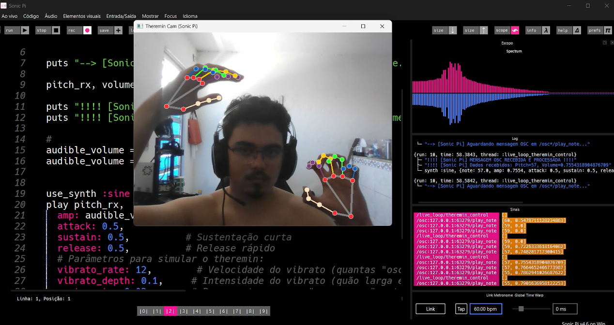

# 🎶 Theremin Virtual com MediaPipe e Sonic Pi 

Projeto de um theremin virtual controlado por gestos das mãos, utilizando **OpenCV** e **MediaPipe** para rastreamento em tempo real. A geração sonora é feita via **OSC** no **Sonic Pi**.

---



---

## 🧰 Tecnologias Utilizadas

- **Python 3.8+** — Linguagem principal do projeto  
- **OpenCV** — Captura e processamento de vídeo da webcam  
- **MediaPipe** — Detecção e rastreamento dos landmarks das mãos  
- **python-osc** — Envio de mensagens OSC para controle sonoro  
- **Numpy** — Operações numéricas de suporte  
- **Sonic Pi** — Ambiente de codificação musical (necessário para gerar som)  
- **SoundDevice** *(opcional)* — Sintetizador simples de som direto no Python  
- **Pygame** *(opcional)* — Visualização artística com fractais

---

## 🚀 Instalação e Configuração

### 1. Clone o repositório
```bash
git clone https://github.com/seu-usuario/theremin-mediapipe.git
cd theremin-mediapipe
```
Ou baixe o ZIP e extraia para uma pasta.

### 2. Instale as dependências Python
Certifique-se de ter o `pip` instalado:
```bash
pip install -r requirements.txt
```

### 3. Instale e configure o Sonic Pi

- Baixe o Sonic Pi: [https://sonic-pi.net/downloads](https://sonic-pi.net/downloads)
- Abra o Sonic Pi
- Copie um dos tracks da pasta `ruby_sonicPi` para um buffer do Sonic Pi
- Execute esse código — ele escutará as mensagens OSC enviadas pelo script Python

---

## 🎮 Como Usar

1. **Abra o Sonic Pi** e execute o track OSC (conforme passo 3 acima)

2. **Execute o script Python**:
```bash
python src/main.py
```

3. **Controle o theremin com as mãos**:
- 🖐 **Mão Direita (Dedo Indicador)**: Move a mão e mude o posicionamento dos dedos para controlar a **altura da nota (pitch)**
- 🖐 **Mão Esquerda (Dedo Indicador)**: Move para cima/baixo para controlar o **volume**
- ⎋ **Pressione `ESC`** para encerrar o programa

---

## 🤝 Contribuição

1. Fork o repositório
2. Crie uma branch (`git checkout -b feature/nova-funcionalidade`)
3. Commit suas mudanças (`git commit -am 'Adiciona nova funcionalidade'`)
4. Push para a branch (`git push origin feature/nova-funcionalidade`)
5. Abra um Pull Request

## 📄 Licença

Este projeto está licenciado sob a [MIT License](LICENSE).

---
